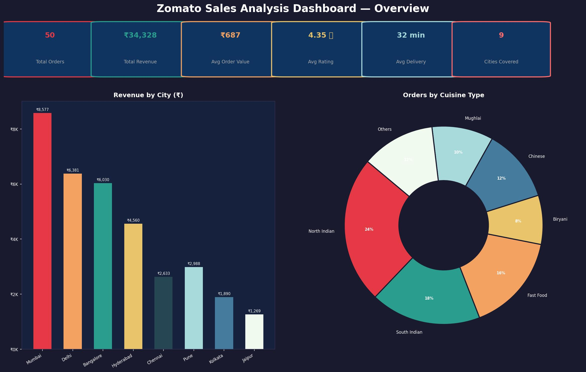
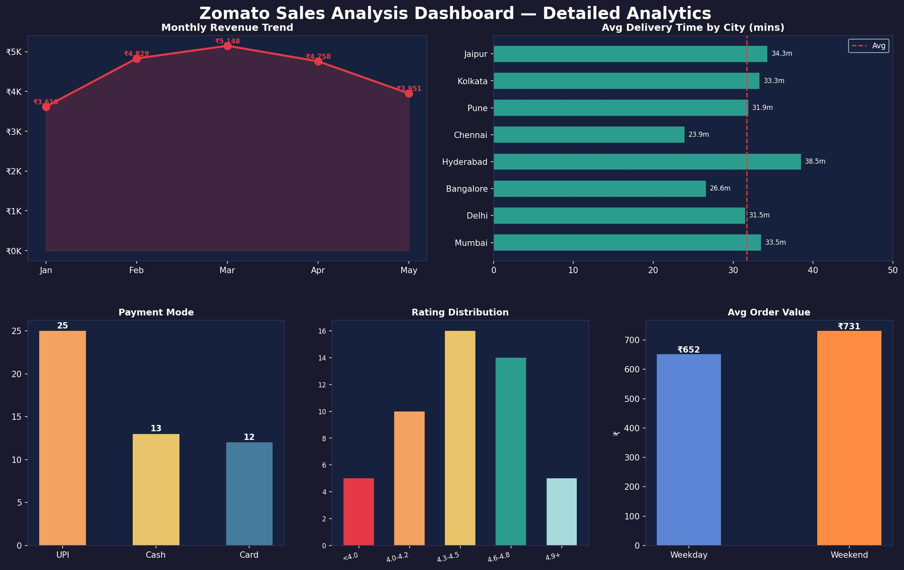

# Zomato Sales Analysis — Business Intelligence Project



## Project Overview

An end-to-end **Business Intelligence project** using **Python and Power BI** to analyse Zomato food delivery sales trends, identify high-revenue cities and cuisines, and evaluate the impact of cuisine type, payment mode, weather, and delivery time on order value and customer ratings across India.

**Student:** Subham Srinibas Behera  
**Batch/Program:** Data Analytics  
**Submission Date:** April 21, 2026

---

## Problem Statement

With the rapid growth of food delivery platforms in India, understanding sales patterns, customer preferences, and delivery efficiency is critical for business decisions. This project analyses Zomato order data to:
- Identify top-performing cities and cuisines by revenue
- Understand peak ordering hours and weekend vs weekday behaviour
- Evaluate the correlation between delivery time, discount, and customer rating
- Build an interactive Power BI dashboard for stakeholder insights

---

## Repository Structure

```
Zomato_Sales_Analysis/
│
├── README.md                    ← Project overview and documentation
├── Zomato_Sales_Analysis.zip    ← Complete project ZIP (all files)
├── accident_records.csv         ← Main Zomato orders dataset (50 records)
├── cuisine_summary.csv          ← Aggregated summary by cuisine type
├── city_sales_index.csv         ← City-level sales performance index
├── data_cleaning.ipynb          ← Python notebook: cleaning + EDA + charts
├── dashboard_page-0001.jpg      ← Power BI Dashboard — Overview page
└── dashboard_page-0002.jpg      ← Power BI Dashboard — Detailed Analytics
```

---

## Dashboard Preview

### Page 1 — Sales Overview


### Page 2 — Detailed Analytics


---

## Key Insights

| Insight | Finding |
|---------|---------|
| 🏙️ Top Revenue City | **Mumbai** (₹8,577) |
| 🍛 Most Ordered Cuisine | **North Indian** (24% of orders) |
| ⭐ Highest Rated Cuisine | **Japanese** (Avg 4.85 / 5.0) |
| 💳 Preferred Payment | **UPI** (50% of orders) |
| 📅 Weekend Effect | Weekend avg order value **12% higher** |
| ⏱️ Fastest Delivery City | **Chennai** (Avg 23.9 minutes) |
| 💰 Avg Order Value | **₹687 per order** |

---

## Tech Stack

| Tool | Purpose |
|------|---------|
| Python 3.10 | Data cleaning, EDA, visualisation |
| Pandas | Data manipulation and aggregation |
| Matplotlib / Seaborn | Charts and plots |
| Power BI | Interactive dashboard |
| Jupyter Notebook | Development environment |
| GitHub | Version control and submission |

---

## Dataset Description

**File:** `accident_records.csv`  
**Records:** 50 orders | **Columns:** 19 features

| Column | Description |
|--------|-------------|
| Order_ID | Unique order identifier |
| Restaurant_Name | Name of the restaurant |
| City | Delivery city |
| Cuisine_Type | Type of cuisine |
| Order_Date / Time | When the order was placed |
| Delivery_Time_mins | Time taken for delivery |
| Order_Value | Original order amount (₹) |
| Discount_Applied | Discount given (₹) |
| Final_Amount | Amount paid after discount |
| Payment_Mode | UPI / Cash / Card |
| Rating | Customer rating (1–5) |
| Customer_Age_Group | Age bracket of customer |
| Day_of_Week / Month | Time features |
| Zone | Geographic zone (North/South/East/West) |
| Weather_Condition | Clear / Rainy / Cloudy |
| Is_Weekend | Yes / No |

---

## How to Run

```bash
# 1. Clone the repository
git clone https://github.com/YOUR_USERNAME/Zomato_Sales_Analysis.git
cd Zomato_Sales_Analysis

# 2. Install dependencies
pip install pandas matplotlib seaborn jupyter

# 3. Run the notebook
jupyter notebook data_cleaning.ipynb
```

---

## Future Improvements

- Expand dataset to 10,000+ real orders using Zomato API
- Add time-series forecasting (Prophet / ARIMA) for demand prediction
- Integrate live data pipeline with Apache Kafka
- Build a Streamlit web app for interactive exploration
- Include restaurant-level profitability analysis

---

## Tags

`python3` `data-analysis` `power-bi-dashboard` `zomato-dataset` `food-delivery` `business-intelligence` `pandas` `matplotlib`

---

*Submitted as part of Capstone Project — April 2026*
